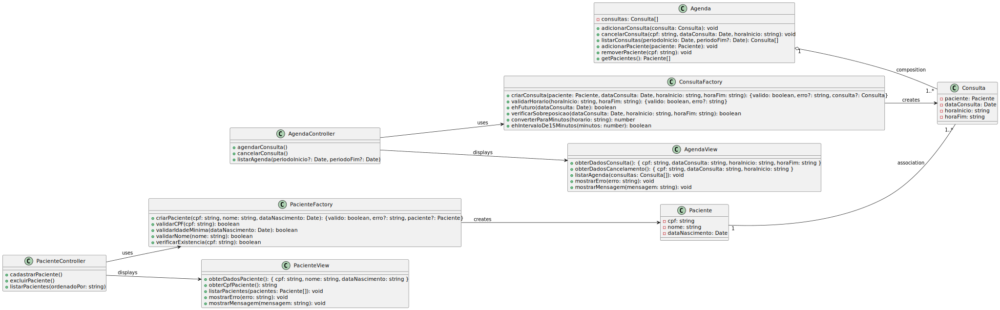

# **Administração da Agenda de um Consultório Odontológico**

Este projeto é uma aplicação console desenvolvida em JavaScript puro, utilizando os padrões de projeto **MVC** e **Factories** para organizar a administração de uma agenda de consultório odontológico. As **views** são responsáveis pela interação com o usuário, enquanto as **factories** gerenciam a validação e a criação das instâncias de dados.

## **Estrutura do Projeto**

### **Models**

1. **Paciente**

   - **Atributos**:
     - `cpf: string`
     - `nome: string`
     - `dataNascimento: Date`
   - **Descrição**: Representa os dados básicos de um paciente, validados no momento de criação através da `PacienteFactory`.

2. **Consulta**

   - **Atributos**:
     - `paciente: Paciente`
     - `dataConsulta: Date`
     - `horaInicio: string`
     - `horaFim: string`
   - **Descrição**: Representa uma consulta agendada de um paciente no consultório odontológico. A `ConsultaFactory` verifica o horário, sobreposição de consultas e outros requisitos antes da criação.

3. **Agenda** (Singleton)
   - **Atributos**:
     - `consultas: Consulta[]`
   - **Métodos**:
     - `adicionarConsulta(consulta: Consulta)`: Adiciona uma nova consulta à lista de consultas.
     - `getConsultas()`: Retorna a lista de consultas agendadas.
     - `adicionarPaciente(paciente: Paciente)`: Adiciona um paciente à lista de pacientes.
     - `removerPaciente(cpf: string)`: Remove um paciente da lista de pacientes.
   - **Descrição**: Mantém um array de consultas e de pacientes e usa o padrão Singleton para garantir que apenas uma instância de `Agenda` exista em toda a aplicação.

---

### **Factories**

1. **PacienteFactory**

   - **Métodos**:
     - `criarPaciente(cpf: string, nome: string, dataNascimento: Date)`: Valida o CPF e a idade mínima, e retorna um objeto `{ valido: boolean, erro?: string, paciente?: Paciente }` com a instância do paciente ou uma mensagem de erro.
     - `validarCPF(cpf: string)`: Valida o CPF usando o algoritmo de cálculo dos dígitos verificadores.
     - `validarIdadeMinima(dataNascimento: Date)`: Verifica se a idade do paciente é igual ou superior a 13 anos.
     - `validarNome(nome: string)`: Verifica se o nome do paciente tem pelo menos 5 caracteres.
     - `verificarExistencia(cpf: string)`: Verifica se já existe um paciente com o mesmo CPF na agenda.
   - **Descrição**: Gerencia a criação de instâncias de `Paciente`, centralizando as validações de CPF, idade mínima, nome e verificação de duplicação de CPF.

2. **ConsultaFactory**
   - **Métodos**:
     - `criarConsulta(paciente: Paciente, dataConsulta: Date, horaInicio: string, horaFim: string)`: Valida o horário, a data futura e a sobreposição de consultas.
     - `validarHorario(horaInicio: string, horaFim: string)`: Valida se o horário atende às regras de negócio (hora final maior que a inicial, intervalos de 15 minutos, horário de funcionamento).
     - `ehFuturo(dataConsulta: Date)`: Verifica se a data da consulta é uma data futura.
     - `verificarSobreposicao(dataConsulta: Date, horaInicio: string, horaFim: string)`: Verifica se a consulta se sobrepõe a outras já agendadas.
   - **Descrição**: Gerencia a criação de instâncias de `Consulta`, validando os requisitos necessários antes da criação.

---

### **Services**

1. **PacienteService**

   - **Métodos**:
     - `adicionarPaciente(cpf: string, nome: string, dataNascimento: Date)`: Adiciona um paciente à lista de pacientes.
     - `removerPaciente(cpf: string)`: Remove um paciente da lista de pacientes.
   - **Descrição**: Realiza operações de negócio relacionadas aos pacientes.

2. **ConsultaService**
   - **Métodos**:
     - `agendarConsulta(cpf: string, dataConsulta: Date, horaInicio: string, horaFim: string)`: Agrega uma consulta à agenda.
     - `cancelarConsulta(cpf: string, dataConsulta: Date, horaInicio: string)`: Cancela uma consulta existente.
   - **Descrição**: Realiza operações de agendamento e cancelamento de consultas.

---

### **Controllers**

1. **PacienteController**

   - **Métodos**:
     - `cadastrarPaciente()`: Chama a `PacienteView` para obter dados e, em seguida, chama `PacienteService` para cadastrar o paciente.
     - `excluirPaciente()`: Solicita um CPF pela `PacienteView` e remove o paciente utilizando `PacienteService`.
     - `listarPacientes(ordenadoPor: string)`: Lista os pacientes ordenados conforme o critério.
   - **Descrição**: Coordena a interação entre a `PacienteView` e o `PacienteService` para o gerenciamento de pacientes.

2. **ConsultaController**
   - **Métodos**:
     - `agendarConsulta()`: Captura informações de agendamento da `ConsultaView` e coordena a criação de uma consulta com a `ConsultaService`.
     - `cancelarConsulta()`: Solicita uma consulta para cancelamento e executa o cancelamento via `ConsultaService`.
     - `listarAgenda()`: Lista as consultas agendadas na agenda.
   - **Descrição**: Coordena a interação entre a `ConsultaView` e o `ConsultaService` para o gerenciamento das consultas na agenda.

---

### **Views**

1. **PacienteView**

   - **Métodos**:
     - `obterDadosPaciente()`: Captura dados do paciente (CPF, nome, data de nascimento) e retorna as informações.
     - `obterCpfPaciente()`: Solicita o CPF de um paciente para exclusão.
     - `listarPacientes(pacientes)`: Exibe a lista de pacientes, chamando o método `toString()` de cada paciente.
     - `mostrarErro(erro)`: Exibe mensagens de erro.
     - `mostrarMensagem(mensagem)`: Exibe mensagens de sucesso ou confirmação.
   - **Descrição**: Responsável pela interação com o usuário para cadastro de pacientes, listagem e exclusão de pacientes.

2. **ConsultaView**
   - **Métodos**:
     - `obterDadosConsulta()`: Captura as informações de agendamento de consulta (CPF, data, hora de início e hora de fim).
     - `obterDadosCancelamento()`: Solicita os dados necessários para o cancelamento de uma consulta.
     - `listarAgenda(consultas)`: Exibe a lista de consultas na agenda.
     - `mostrarErro(erro)`: Exibe mensagens de erro.
     - `mostrarMensagem(mensagem)`: Exibe mensagens de sucesso ou confirmação.
   - **Descrição**: Exibe e captura os dados de agendamento de consultas e exibe as mensagens de erro ou sucesso.

---

### Diagrama de Classes

---

### **App**

O arquivo `app.js` gerencia o fluxo principal da aplicação, exibindo menus para o usuário e interagindo com os **controllers** para realizar operações no cadastro de pacientes e no agendamento de consultas.

- O **menu principal** permite que o usuário escolha entre as opções de cadastro de pacientes ou agendamento de consultas.
- Dentro do **menu de cadastro de pacientes**, o usuário pode cadastrar novos pacientes, excluir pacientes ou listar os pacientes existentes.
- O **menu de agenda** permite ao usuário agendar consultas, cancelar consultas ou listar todas as consultas agendadas.

---

## **Organização e Fluxo**

- **Factories**: Gerenciam as validações e criação das instâncias `Paciente` e `Consulta`, incluindo os métodos de validação necessários para garantir que os dados estejam corretos antes de criar uma nova instância.
- **Controllers**: Coordenam a lógica entre Services e Views, chamando as factories quando necessário.
- **Views**: Responsáveis pela interação com o usuário, incluindo a exibição de mensagens e a solicitação de dados. As Views agora exibem todas as mensagens de erro e sucesso com base nos retornos das factories, melhorando a separação de responsabilidades.
- **Singleton em Agenda**: A classe `Agenda` foi implementada como Singleton para permitir acesso global e consistente à lista de consultas.
